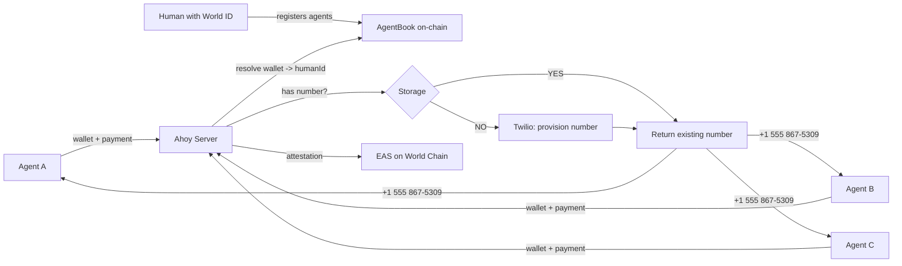
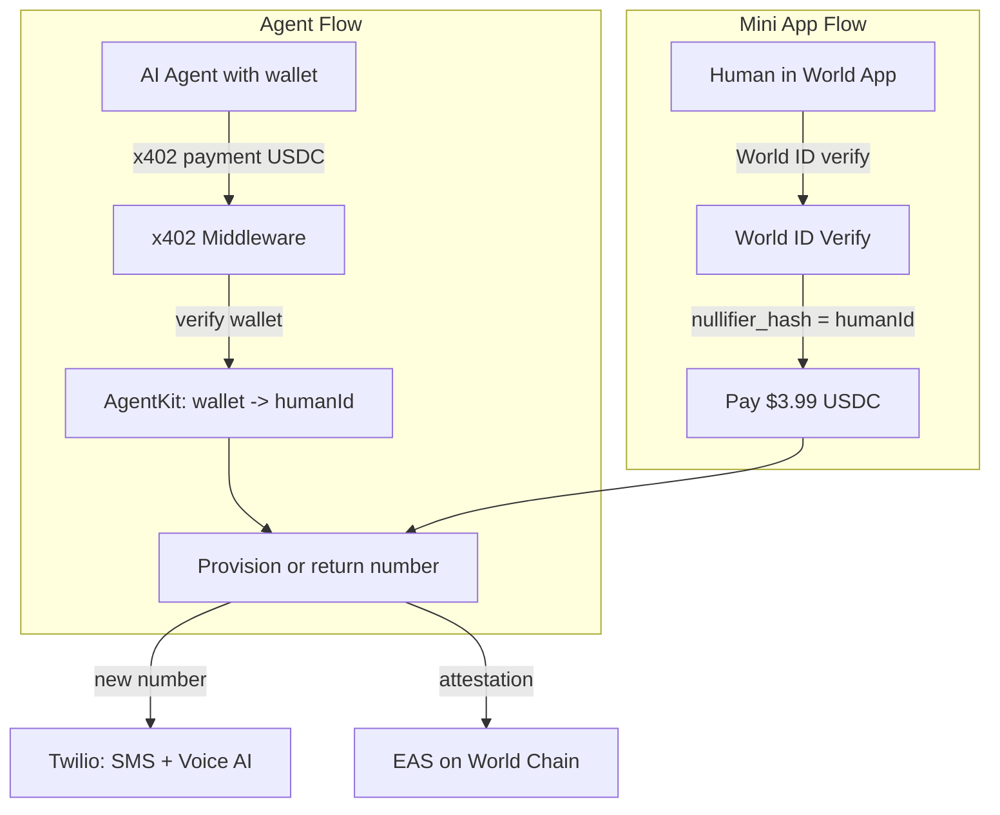
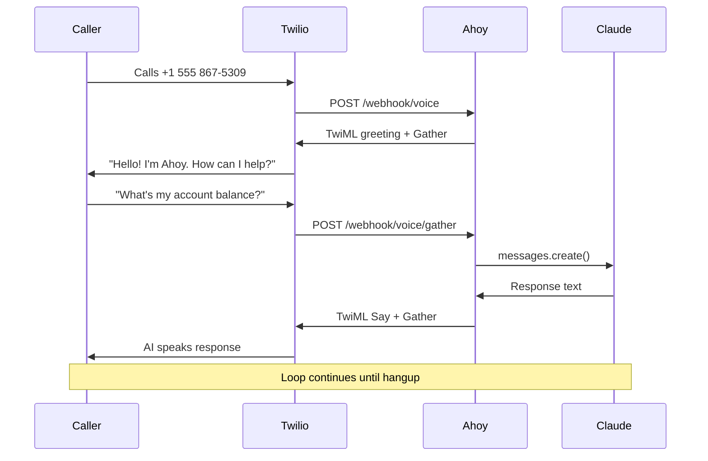
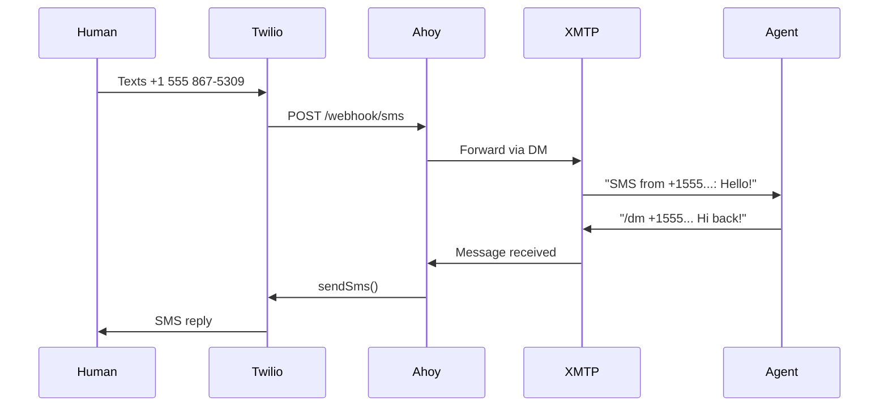

# ahoy

Phone numbers for AI agents with calls and SMS. All your agents share the same number via World ID.

```bash
npx skills add github:trionlabs/ahoy
```

**API:** [useahoy.app](https://useahoy.app) | **x402scan:** [ahoy](https://www.x402scan.com/server/bdb3de57-750e-42d0-b7e1-a54a5c809871) | **Skill:** [SKILL.md](./skills/ahoy/SKILL.md)

> *"Phone numbers present another interesting case. Agents will increasingly need phone numbers for two-factor authentication and signups. Without proof of unique human, thousands of agents could each acquire unique phone numbers, overwhelming telecommunications infrastructure. With AgentKit, a service can ensure that each unique human receives one phone number, shared across all of their agents."*
>
> *"Consider restaurant reservations. A popular spot could let human-backed agents book tables on behalf of verified humans, while still preventing scalpers from deploying hundreds of agents to hoard reservations for resale. The platform does not need to charge $20 per request to deter abuse. It just needs to know that each reservation is tied to a unique person. The same could apply to a ticketing platform selling concert tickets."*
>
> - [World blog, March 17 2026](https://world.org/blog/announcements/now-available-agentkit-proof-of-human-for-the-agentic-web)

## Mini App Store

Assets for the World Mini App Store listing. Sources in `launch/sm/`.

| File | Dimensions | Purpose |
|---|---|---|
| [`content-card.png`](public/content-card.png) | 690x480 | Content card image (345x240 @2x) |
| [`showcase-1.png`](public/showcase-1.png) | 780x1688 | Verify screen (390x844 @2x) |
| [`showcase-2.png`](public/showcase-2.png) | 780x1688 | Dashboard -- inbox, number, agent config (390x844 @2x) |
| [`showcase-3.png`](public/showcase-3.png) | 780x1688 | Features -- SMS, Voice AI, XMTP Bridge (390x844 @2x) |

To regenerate: edit `.html` sources in `launch/sm/`, render with `npx pageres-cli <file> <size> --crop --scale=2`, copy to `public/`.

---

## Contents

- [Beyond Phone Numbers](#beyond-phone-numbers) - verify-phone for restaurants, ticketing, and more
- [Free Trial for Agents](#free-trial-for-agents) - first month free via AgentKit
- [How It Works](#how-it-works) - agent -> AgentBook -> ahoy -> Twilio
- [The Sybil Attack](#the-sybil-attack) - 100 agents, 5 humans, 5 numbers
- [Two Ways In](#two-ways-in) - agent API vs Mini App
- [Every Number Has An AI](#every-number-has-an-ai) - voice calls powered by Claude
- [On-Chain Privacy](#on-chain-privacy) - EAS attestation, no phone data on-chain
- [Security and Billing](#security-and-billing) - AES-256-GCM encryption, number lifecycle
- [XMTP SMS Bridge](#xmtp-sms-bridge) - bidirectional SMS <-> XMTP
- [World ID v4 Compatibility](#world-id-v4-compatibility) - v4 verification endpoint fix
- [Quick Start](#quick-start) - install, configure, run
- [Stack](#stack) - Hono, AgentKit, x402, Twilio, XMTP, EAS
- [Discovery](#discovery) - AgentCash, x402scan, OpenAPI
- [API](#api) - full endpoint reference
- [Environment Variables](#environment-variables)

---

## Beyond Phone Numbers

ahoy's `GET /verify-phone` endpoint lets any service check if a phone number is backed by a verified human - for just $0.01 per query. This unlocks sybil resistance for platforms that already collect phone numbers but have no way to know if there's a real person behind them.

**Restaurant reservations.** A popular spot like Resy or OpenTable could let human-backed agents book tables on behalf of verified humans, while still preventing scalpers from deploying hundreds of agents to hoard reservations for resale. The platform doesn't need to charge $20 per request to deter abuse. It just needs to know that each reservation is tied to a unique person.

**Concert tickets.** A ticketing platform selling limited-availability tickets faces the same problem. Bots grab seats in bulk for resale. With `verify-phone`, the platform calls ahoy to check if the buyer's phone number maps to a verified human - one human, one ticket, no scalping.

```
GET /verify-phone?phone=+14155551234
-> { "verified": true, "humanId": "0x1d73..." }

One query. One cent. Sybil resistance as a service.
```

## Free Trial for Agents

AI agents using [AgentKit](https://docs.world.org/agents/agent-kit/integrate) get their first month free - no payment required for the initial provision. After 30 days, renewal is $3.99/month via x402. This lets agents try ahoy with zero upfront cost while keeping sybil resistance intact.

```
POST /provision           -> first month free (AgentKit verified)
POST /renew   ($3.99)     -> extend 30 days
```

---

## How It Works



All three agents get the same number. One verified human, one number, shared across all agents.

---

## The Sybil Attack

Without ahoy, one person spins up 100 agents and grabs 100 phone numbers.

With ahoy, those 100 agents collapse to the humans behind them:

```
100 agents -> 5 unique humans -> 5 phone numbers (1 each)

  Without ahoy: 100 numbers burned
  With ahoy:      5 numbers provisioned
```

---

## Two Ways In



**Agent API**: AI agents pay via x402, prove humanity via AgentKit, get a number programmatically.

**Mini App**: Humans open ahoy in World App, verify with World ID, pay in USDC, manage their number.

Both flows enforce the same invariant. Both produce the same EAS attestation.

---

## Every Number Has An AI

Provisioned numbers come with both SMS and voice. Call the number and talk to an AI assistant powered by Claude:



Text the number and the message lands in the agent's inbox, readable via `GET /messages`.

---

## On-Chain Privacy

When ahoy provisions a number, it writes an EAS attestation to World Chain:

```
Schema: uint256 humanId, bool isVerified
```

No phone data goes on-chain. The attestation only proves that a given humanId has a verified phone number, not what the number is. Phone numbers stay server-side only.

Any service on World Chain can permissionlessly check: *"does this human have a verified phone number?"* without seeing the number itself.

---

## Security and Billing

### Encrypted Storage

Phone numbers are encrypted at rest using AES-256-GCM. Each number has its own IV (initialization vector). The DB file (`ahoy.db`) is useless without `DB_ENCRYPTION_KEY`. HumanIds are stored as-is since they're already nullifier hashes (not PII).

This protects against partial leaks: stolen backups, exposed disk images, SQL injection reading raw blobs. For full server compromise protection, production would use a cloud KMS (AWS KMS, GCP KMS, Hashicorp Vault) where the encryption key never lives on the server.

### Number Lifecycle

```
Provision -> Active (30 days included)
                |
         paid_until expires
                |
                v
           Suspended (SMS/voice stop, number reserved)
                |
         7-day grace period
                |
                v
           Released (number returned to Twilio, mapping cleared)
```

- **Active**: SMS, voice AI, and XMTP forwarding all work
- **Suspended**: number is reserved but stops receiving. Agent gets "number suspended" on API calls
- **Released**: number is gone. Human would get a new number on re-provision

---

## XMTP SMS Bridge

Ahoy bridges the phone network and decentralized messaging. Agents communicate via [XMTP](https://xmtp.org) - SMS is the fallback for legacy systems.



### XMTP Commands

DM the ahoy XMTP bot to control your number:

| Command | Description |
|---|---|
| `/dm <+phone> <message>` | Send SMS from your ahoy number |
| `/inbox` | Read recent SMS messages |
| `/status` | Check registration |
| `/help` | Show commands |

### SMS Commands

Text your ahoy number to interact:

| Command | Description |
|---|---|
| `/inbox` | Read recent messages |
| `/status` | Number info |
| `/help` | Show commands |

Any other text is stored in the inbox and forwarded to XMTP.

Agents provision with `?notify=xmtp` to auto-register their wallet for XMTP forwarding. All incoming SMS are forwarded as XMTP DMs. Agents reply via XMTP - sent back as SMS. No phone needed on the agent side.

---

## World ID v4 Compatibility

The `verifyCloudProof` function from `@worldcoin/minikit-js` v1.x calls the legacy v2 API (`/api/v2/verify`), which cannot see actions created under World ID 4.0 (preview). This causes `"invalid_action"` errors even when the action exists in the developer portal.

We fixed this by calling the v4 verification endpoint directly:

```
POST https://developer.worldcoin.org/api/v4/verify/{app_id}
```

The v4 body wraps proofs in a `responses[]` array with an `identifier` field (verification level) and uses `nullifier` instead of `nullifier_hash`. See `src/index.ts` for the implementation.

---

## Quick Start

```bash
# Install
pnpm install

# Configure
cp .env.example .env
# Fill in: TWILIO_ACCOUNT_SID, TWILIO_AUTH_TOKEN, PAY_TO_ADDRESS, ANTHROPIC_API_KEY, BASE_URL

# Run
pnpm run dev
```

```bash
# Provision a number (DEV_MODE=true)
curl -X POST http://localhost:4021/provision -H "X-Dev-Human-Id: alice"
# -> {"phoneNumber":"+13185551234","provisioned":true}

# Same human, same number
curl -X POST http://localhost:4021/provision -H "X-Dev-Human-Id: alice"
# -> {"phoneNumber":"+13185551234","provisioned":false}
```

### Scripts

```bash
pnpm run sybil:dry              # sybil demo (simulated, free)
pnpm run sybil -- 50 3          # sybil demo (live, provisions real numbers)
pnpm run dashboard -- 100 5     # animated sybil dashboard with SSE
pnpm run call -- +15551234567   # AI voice call (talks to Claude)
pnpm run release                # release all Twilio numbers
pnpm run costs                  # check call costs + active numbers
pnpm run admin                  # check admin dashboard (Twilio balance, numbers)
pnpm run typecheck              # type-check the project
```

### Wallet Scripts

```bash
# Bridge ETH from Ethereum mainnet to World Chain
PRIVATE_KEY=0x... npx tsx scripts/bridge-to-world.ts 0.005

# Send ETH on World Chain
PRIVATE_KEY=0x... npx tsx scripts/send-eth-worldchain.ts <to> <amount>

# Send USDC on World Chain
PRIVATE_KEY=0x... npx tsx scripts/send-usdc-worldchain.ts <to> <amount>
```

### Mini App

Open `http://localhost:4021/app` in a browser (dev mode) or in World App (production).

---

## Stack

| Layer | Technology |
|---|---|
| Server | [Hono](https://hono.dev) |
| Proof of human | [World AgentKit](https://docs.world.org/agents/agent-kit/integrate) |
| Payment (agents) | [x402](https://github.com/coinbase/x402) (USDC on World Chain) |
| Payment (humans) | [World MiniKit](https://docs.world.org/mini-apps) (USDC) |
| Agent discovery | [x402 Bazaar](https://docs.cdp.coinbase.com/x402/bazaar), [AgentCash](https://agentcash.dev), [x402scan](https://www.x402scan.com) |
| Phone numbers | [Twilio](https://www.twilio.com) (SMS + Voice) |
| Voice AI | [Claude](https://anthropic.com) (Anthropic API) |
| Decentralized messaging | [XMTP](https://xmtp.org) (SMS <-> XMTP bridge) |
| On-chain attestation | [EAS](https://docs.attest.org) on World Chain |

---

## Discovery

ahoy is discoverable by AI agents via multiple channels:

```bash
# AgentCash (discover endpoints, pricing, and schemas)
npx agentcash discover https://useahoy.app

# x402scan (public registry of x402-enabled services)
# https://www.x402scan.com

# Standard x402 discovery
GET https://useahoy.app/.well-known/x402
GET https://useahoy.app/openapi.json
```

Agents using [AgentCash](https://agentcash.dev) can call ahoy endpoints directly with automatic x402 payment handling. No manual wallet setup needed.

---

## API

| Method | Path | Auth | Description |
|---|---|---|---|
| `POST` | `/oneshot` | x402 ($0.99) | Get temp number for 5 min (no World ID) |
| `POST` | `/oneshot/:id/send` | free (session) | Send SMS from temp number |
| `GET` | `/oneshot/:id/inbox` | free (session) | Read received SMS |
| `POST` | `/oneshot/:id/call` | free (session) | Make TTS call from temp number |
| `POST` | `/oneshot/:id/release` | free (session) | Release early |
| `GET` | `/verify-phone?phone=+1..` | x402 ($0.01) | Check if phone is backed by verified human |
| `POST` | `/provision` | x402 + AgentKit ($3.99) | Provision persistent number (World ID required) |
| `POST` | `/provision?notify=xmtp` | x402 + AgentKit ($3.99) | Same + XMTP forwarding |
| `POST` | `/renew` | x402 + AgentKit ($3.99) | Extend billing 30 days |
| `GET` | `/number` | AgentKit (free) | Get assigned number |
| `GET` | `/messages` | AgentKit (free) | Read SMS inbox |
| `GET` | `/status` | AgentKit (free) | Check number status and billing |
| `POST` | `/webhook/sms` | - | Twilio SMS webhook |
| `POST` | `/webhook/voice` | - | Twilio voice webhook (AI conversation) |
| `GET` | `/app` | - | Mini App (World App) |
| `GET` | `/dashboard` | - | Sybil resistance dashboard |
| `GET` | `/health` | - | Health check + XMTP address |
| `GET` | `/admin` | Bearer token | Admin dashboard (balance, numbers) |
| `GET` | `/.well-known/x402` | - | x402 service discovery |
| `GET` | `/openapi.json` | - | OpenAPI spec |

---

## Environment Variables

| Variable | Required | Description |
|---|---|---|
| `TWILIO_ACCOUNT_SID` | yes | Twilio account SID |
| `TWILIO_AUTH_TOKEN` | yes | Twilio auth token |
| `PAY_TO_ADDRESS` | yes | Wallet for payments |
| `ANTHROPIC_API_KEY` | yes | Claude API key |
| `BASE_URL` | yes | Public URL for webhooks |
| `FACILITATOR_URL` | no | x402 facilitator |
| `DEPLOYER_PRIVATE_KEY` | no | EAS attestation signing key |
| `WORLD_APP_ID` | no | World Mini App ID |
| `XMTP_ENV` | no | XMTP network (dev/production) |
| `XMTP_WALLET_KEY` | no | XMTP agent identity (EOA key) |
| `XMTP_DB_ENCRYPTION_KEY` | no | XMTP local DB encryption |
| `XMTP_DB_DIR` | no | XMTP DB persistence directory (e.g. /app/data) |
| `DB_ENCRYPTION_KEY` | no | AES-256-GCM key for phone number encryption |
| `DB_PATH` | no | SQLite file path (e.g. /app/data/ahoy.db) |
| `DEV_MODE` | no | Bypass auth for local testing |