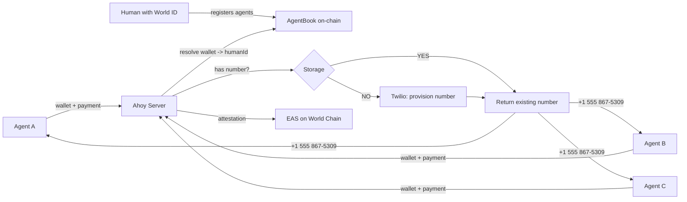
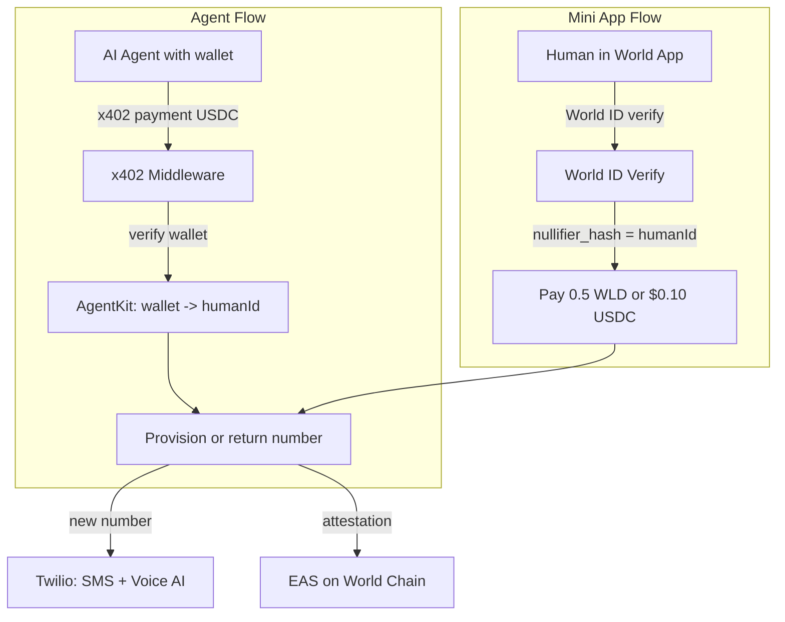
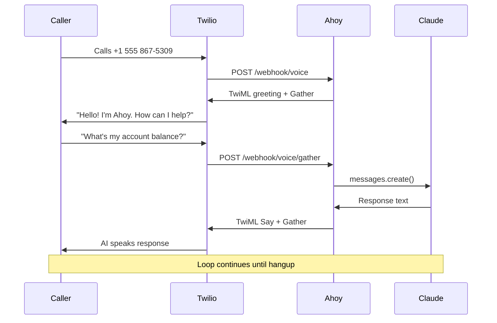

# ahoy

Sybil-resistant phone numbers with AI-powered calls and SMS for agents. One World ID = one number, every agent shares it.

> "Phone numbers present another interesting case. Agents will increasingly need phone numbers for two-factor authentication and signups. Without proof of unique human, thousands of agents could each acquire unique phone numbers, overwhelming telecommunications infrastructure. With AgentKit, a service can ensure that each unique human receives one phone number, shared across all of their agents."
> - [World blog, March 17 2026](https://world.org/blog/announcements/now-available-agentkit-proof-of-human-for-the-agentic-web)

---

## How It Works



All three agents get the same number. One human, one number.

---

## The Sybil Attack

Without ahoy, one person spins up 100 agents and grabs 100 phone numbers.

With ahoy, those 100 agents collapse to the humans behind them:

```
100 agents -> 5 unique humans -> 5 phone numbers

  Without ahoy: 100 numbers burned
  With ahoy:    5 numbers provisioned
```

---

## Two Ways In



**Agent API**: AI agents pay via x402, prove humanity via AgentKit, get a number programmatically.

**Mini App**: Humans open ahoy in World App, verify with World ID, pay in WLD or USDC, manage their number.

Both flows enforce the same invariant. Both produce the same EAS attestation.

---

## Every Number Has An AI

Provisioned numbers come with both SMS and voice. Call the number and talk to an AI assistant powered by Claude:



Text the number and the message lands in the agent's inbox, readable via `GET /messages`.

---

## On-Chain Privacy

When ahoy provisions a number, it writes an EAS attestation to World Chain:

```
Schema: uint256 humanId, bool isVerified
```

No phone data goes on-chain. The attestation only proves that a given humanId has a verified phone number, not what the number is. Phone numbers stay server-side only.

Any service on World Chain can permissionlessly check: *"does this human have a verified phone number?"* without seeing the number itself.

---

## Security and Billing

### Encrypted Storage

Phone numbers are encrypted at rest using AES-256-GCM. Each number has its own IV (initialization vector). The DB file (`ahoy.db`) is useless without `DB_ENCRYPTION_KEY`. HumanIds are stored as-is since they're already nullifier hashes (not PII).

This protects against partial leaks: stolen backups, exposed disk images, SQL injection reading raw blobs. For full server compromise protection, production would use a cloud KMS (AWS KMS, GCP KMS, Hashicorp Vault) where the encryption key never lives on the server.

### Number Lifecycle

```
Provision -> Active (30 days included)
                |
         paid_until expires
                |
                v
           Suspended (SMS/voice stop, number reserved)
                |
         7-day grace period
                |
                v
           Released (number returned to Twilio, mapping cleared)
```

- **Active**: SMS, voice AI, and XMTP forwarding all work
- **Suspended**: number is reserved but stops receiving. Agent gets "number suspended" on API calls
- **Released**: number is gone. Human would get a new number on re-provision

---

## XMTP SMS Bridge

Ahoy bridges the phone network and decentralized messaging. Agents communicate via [XMTP](https://xmtp.org) - SMS is the fallback for legacy systems.


Agents register their XMTP address to an ahoy number, then receive all SMS as XMTP messages and reply via XMTP - sent back as SMS. No phone needed on the agent side.

---

## World ID v4 Compatibility

The `verifyCloudProof` function from `@worldcoin/minikit-js` v1.x calls the legacy v2 API (`/api/v2/verify`), which cannot see actions created under World ID 4.0 (preview). This causes `"invalid_action"` errors even when the action exists in the developer portal.

We fixed this by calling the v4 verification endpoint directly:

```
POST https://developer.worldcoin.org/api/v4/verify/{app_id}
```

The v4 body wraps proofs in a `responses[]` array with an `identifier` field (verification level) and uses `nullifier` instead of `nullifier_hash`. See `src/index.ts` for the implementation.

---

## Quick Start

```bash
# Install
pnpm install

# Configure
cp .env.example .env
# Fill in: TWILIO_ACCOUNT_SID, TWILIO_AUTH_TOKEN, PAY_TO_ADDRESS, ANTHROPIC_API_KEY, BASE_URL

# Run
pnpm run dev
```

```bash
# Provision a number (DEV_MODE=true)
curl -X POST http://localhost:4021/provision -H "X-Dev-Human-Id: alice"
# -> {"phoneNumber":"+13185551234","provisioned":true}

# Same human, same number
curl -X POST http://localhost:4021/provision -H "X-Dev-Human-Id: alice"
# -> {"phoneNumber":"+13185551234","provisioned":false}
```

### Sybil Demo

```bash
# Simulated (free, no Twilio calls)
npx tsx scripts/sybil-demo.ts 100 5 --dry-run

# Live (provisions real numbers)
npx tsx scripts/sybil-demo.ts 50 3
```

### AI Voice Call

```bash
# Call someone, they talk to Claude
npx tsx scripts/call.ts +15551234567

# One-time TTS message
npx tsx scripts/call.ts +15551234567 --tts "Hello from ahoy!"
```

### Mini App

Open `http://localhost:4021/app` in a browser (dev mode) or in World App (production).

---

## Stack

| Layer | Technology |
|---|---|
| Server | [Hono](https://hono.dev) |
| Proof of human | [World AgentKit](https://docs.world.org/agents/agent-kit/integrate) |
| Payment (agents) | [x402](https://github.com/coinbase/x402) (USDC on World Chain) |
| Payment (humans) | [World MiniKit](https://docs.world.org/mini-apps) (WLD / USDC) |
| Agent discovery | [x402 Bazaar](https://docs.cdp.coinbase.com/x402/bazaar) |
| Phone numbers | [Twilio](https://www.twilio.com) (SMS + Voice) |
| Voice AI | [Claude](https://anthropic.com) (Anthropic API) |
| Decentralized messaging | [XMTP](https://xmtp.org) (SMS <-> XMTP bridge) |
| On-chain attestation | [EAS](https://docs.attest.org) on World Chain |

---

## API

| Method | Path | Auth | Description |
|---|---|---|---|
| `POST` | `/provision` | x402 + AgentKit | Provision a number |
| `GET` | `/number` | x402 + AgentKit | Get assigned number |
| `GET` | `/messages` | x402 + AgentKit | Read SMS inbox |
| `POST` | `/renew` | x402 + AgentKit | Extend billing 30 days |
| `GET` | `/status` | x402 + AgentKit | Check number status and billing |
| `POST` | `/webhook/sms` | - | Twilio SMS webhook |
| `POST` | `/webhook/voice` | - | Twilio voice webhook (AI conversation) |
| `GET` | `/app` | - | Mini App (World App) |
| `GET` | `/dashboard` | - | Sybil resistance dashboard |
| `GET` | `/health` | - | Health check + XMTP address |

---

## Environment Variables

| Variable | Required | Description |
|---|---|---|
| `TWILIO_ACCOUNT_SID` | yes | Twilio account SID |
| `TWILIO_AUTH_TOKEN` | yes | Twilio auth token |
| `PAY_TO_ADDRESS` | yes | Wallet for payments |
| `ANTHROPIC_API_KEY` | yes | Claude API key |
| `BASE_URL` | yes | Public URL for webhooks |
| `FACILITATOR_URL` | no | x402 facilitator |
| `DEPLOYER_PRIVATE_KEY` | no | EAS attestation signing key |
| `WORLD_APP_ID` | no | World Mini App ID |
| `XMTP_ENV` | no | XMTP network (dev/production) |
| `XMTP_WALLET_KEY` | no | XMTP agent identity (EOA key) |
| `XMTP_DB_ENCRYPTION_KEY` | no | XMTP local DB encryption |
| `DB_ENCRYPTION_KEY` | no | AES-256-GCM key for phone number encryption |
| `DEV_MODE` | no | Bypass auth for local testing |